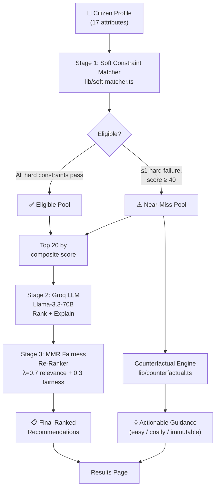

# GovSchemes AI — Government Welfare Scheme Recommendation System

An AI-powered web platform that helps Indian citizens discover government welfare schemes they are eligible for. Users fill a simple profile, and the system matches them against **289 real government schemes** using a **hybrid soft constraint matcher**, **counterfactual explainability engine**, and **fairness-aware re-ranking** — with optional LLM explanations via Groq (Llama 3.3 70B).

## Problem Statement

India has hundreds of central and state welfare schemes, yet most citizens never claim their entitlements. Portals like [myScheme.gov.in](https://www.myscheme.gov.in/) use strict binary eligibility filters — a citizen earning ₹2,51,000 against a ₹2,50,000 ceiling is treated identically to someone earning ₹10,00,000. GovSchemes AI replaces this binary approach with continuous scoring, actionable near-miss guidance, and fairness-aware ranking.

## Key Features

- **Hybrid Soft Constraint Matcher** — Replaces binary pass/fail with continuous eligibility scores using linear and exponential decay functions
- **Counterfactual Explanations** — "What single change would make you eligible?" with a 3-tier mutability taxonomy (easy / costly / immutable)
- **Fairness-Aware Re-Ranking** — MMR-based re-ranker balancing relevance (70%) with demographic fairness (30%) across gender, caste, and income groups
- **289 Real Government Schemes** — Including ~50 student schemes, 25 farmer schemes, 11 Maharashtra-specific state schemes, and 8 teacher/salaried schemes
- **LLM-Powered Explanations** — Groq API (Llama 3.3 70B) generates plain-language scheme explanations, with template fallback when unavailable
- **4-Step Onboarding Wizard** — Guided profile collection with real-time validation
- **Smart Filtering & Search** — Filter by benefit type, scheme level, search by name, toggle near-misses
- **User Dashboard** — Profile summary, saved schemes, re-run recommendations
- **Mobile-First Design** — Fully responsive with WCAG 2.1 AA accessibility

## System Architecture



### Three-Stage Pipeline

1. **Soft Constraint Matching** — Evaluates all 289 schemes against the user profile. Hard constraints (gender, caste, state) are strict pass/fail. Soft constraints (age, income) use decay functions to assign partial scores (0–1). Produces a composite score (0–100) per scheme.

2. **LLM Ranking + Explanation** — Top 20 schemes are sent to Groq's Llama-3.3-70B for relevance ranking and plain-language explanations. Falls back to template-based explanations if the API is unavailable.

3. **Fairness Re-Ranking** — MMR-inspired re-ranker adjusts order: `Final Score = 0.7 × Relevance + 0.3 × Fairness Bonus`. The fairness bonus includes demographic boost, benefit-type diversity, and high-value scheme prioritization.

### Counterfactual Engine

For near-miss schemes, the system generates actionable suggestions ranked by mutability:

| Tier | Examples | Actionability Score |
|------|----------|-------------------|
| **Easy** | Get a ration card, submit documentation | 0.8–0.9 |
| **Costly** | Change income, employment, education | 0.3–0.5 |
| **Immutable** | Age, gender, caste, disability | 0.0 |

## Tech Stack

| Layer | Technology |
|-------|------------|
| **Framework** | Next.js 16 (App Router), React 19 |
| **Language** | TypeScript 5 (strict mode) |
| **Styling** | Tailwind CSS v4 |
| **Icons** | Lucide React |
| **LLM** | Groq API — Llama 3.3 70B Versatile |
| **Auth/Storage** | localStorage (Supabase-ready) |
| **Scheme Data** | 289 schemes in `seed-schemes.ts` (scraped from myScheme.gov.in + CSV imports) |
| **Evaluation** | 3 evaluation scripts (matcher, counterfactual, fairness) |

## Project Structure

```
gschemesai/
├── app/
│   ├── layout.tsx                  # Root layout (Inter font, AuthProvider)
│   ├── page.tsx                    # Landing page
│   ├── globals.css                 # Design system tokens + global styles
│   ├── error.tsx                   # Error boundary
│   ├── not-found.tsx               # 404 page
│   ├── onboarding/page.tsx         # 4-step profile wizard
│   ├── results/page.tsx            # Scheme recommendations with filters
│   ├── dashboard/page.tsx          # User dashboard
│   ├── scheme/[id]/page.tsx        # Scheme detail + counterfactual view
│   └── api/
│       ├── recommend/route.ts      # Core 3-stage recommendation pipeline
│       ├── counterfactual/route.ts # Counterfactual explanation endpoint
│       ├── explain/route.ts        # Single scheme AI explanation
│       ├── schemes/route.ts        # Fetch/search all schemes
│       └── profile/route.ts        # User profile CRUD
├── components/
│   ├── ui/                         # Button, Card, Badge, Input, Select, Spinner
│   ├── layout/                     # Navbar, Footer, PageWrapper
│   ├── landing/                    # HeroSection, StatsBar, HowItWorks, TrustSection
│   ├── forms/                      # ProgressBar, StepBasicInfo, StepIncome, StepCategory, StepEducation
│   ├── schemes/                    # SchemeCard, SchemeCardSkeleton, CounterfactualCard, FairnessBadge
│   └── auth/                       # AuthModal (login/signup)
├── lib/
│   ├── types.ts                    # Core TypeScript interfaces (UserProfile, Scheme, SoftMatchResult, etc.)
│   ├── constants.ts                # Indian states, gender/caste/income/employment options
│   ├── soft-matcher.ts             # Hybrid soft constraint matcher (4 decay functions)
│   ├── matcher.ts                  # Binary baseline matcher (for evaluation comparison)
│   ├── counterfactual.ts           # Counterfactual explanation generator
│   ├── constraint-config.ts        # Hard/soft constraint taxonomy + decay parameters
│   ├── fair-reranker.ts            # MMR-based fairness-aware re-ranker
│   ├── fairness.ts                 # Fairness audit framework (Gini, demographic parity)
│   ├── groq.ts                     # Groq LLM client (ranking + explanations + fallback)
│   ├── seed-schemes.ts             # 289 government scheme definitions (219 KB)
│   ├── auth-context.tsx            # Auth + saved schemes React context (localStorage)
│   └── supabase.ts                 # Supabase client with fallback
├── scripts/
│   ├── evaluate-matcher.ts         # Binary vs soft matcher comparison
│   ├── evaluate-counterfactuals.ts # Counterfactual validity testing
│   ├── run-fairness-audit.ts       # Demographic fairness audit (240 profiles)
│   ├── scrape-myscheme.ts          # myScheme.gov.in web scraper
│   ├── csv-to-seed.ts              # CSV → seed-schemes.ts converter
│   └── merge-scraped.ts            # Merge scraped data into seed
├── paper.tex                       # IEEE research paper (LaTeX)
├── paper_diagrams.md               # Mermaid diagram definitions for paper figures
├── presentation_content.md         # Presentation slides content
├── package.json
├── tsconfig.json
├── next.config.ts
├── postcss.config.mjs
└── eslint.config.mjs
```

## Getting Started

### Prerequisites

- **Node.js** v18 or higher
- **npm** (or yarn/pnpm)

### Installation

```bash
# Clone the repository
git clone https://github.com/sakureninad-png/GovSchemes-AI.git
cd GovSchemes-AI

# Install dependencies
npm install
```

### Environment Variables

Create a `.env.local` file in the project root:

```env
# Groq AI (optional — falls back to template explanations)
GROQ_API_KEY=your_groq_api_key
GROQ_MODEL=llama-3.3-70b-versatile
```

> **Note:** The system works fully without Groq configured. Without an API key, the recommendation engine uses template-based explanations instead of LLM-generated ones. All matching, counterfactual, and fairness features work locally with no external dependencies.

### Running the Application

```bash
# Development server
npm run dev

# Production build
npm run build
npm run start
```

Open [http://localhost:3000](http://localhost:3000) in your browser.

### Running Evaluation Scripts

```bash
# Compare binary vs soft matcher
npx tsx scripts/evaluate-matcher.ts

# Validate counterfactual quality
npx tsx scripts/evaluate-counterfactuals.ts

# Run fairness audit across 240 synthetic profiles
npx tsx scripts/run-fairness-audit.ts
```

## API Endpoints

| Endpoint | Method | Description |
|----------|--------|-------------|
| `/api/recommend` | POST | Submit user profile → 3-stage pipeline → ranked recommendations |
| `/api/counterfactual` | POST | Generate counterfactual explanations for a near-miss scheme |
| `/api/explain` | POST | Generate AI explanation for a specific scheme + user profile |
| `/api/schemes` | GET | Fetch all schemes with optional search/filter params |
| `/api/profile` | POST/GET | Save or retrieve user profiles |

## Pages

| Route | Description |
|-------|-------------|
| `/` | Landing page with hero, stats, how-it-works, and trust sections |
| `/onboarding` | 4-step profile form (basic info → income → category → education) |
| `/results` | Scheme recommendations with search, filters, and near-miss toggle |
| `/scheme/[id]` | Scheme detail with eligibility checklist, AI explanation, and counterfactual guidance |
| `/dashboard` | User dashboard with saved schemes and profile summary |

## Scheme Coverage

The system includes **289 real Indian government schemes** across categories:

| Category | Count | Examples |
|----------|-------|----------|
| **Student/Education** | ~50 | SWAYAM, PM Vidyalaxmi, Central Sector Scholarship, MahaDBT |
| **Farmer/Agriculture** | 25 | PM-KISAN, Fasal Bima, Kisan Credit Card, Namo Shetkari |
| **Healthcare** | 20+ | Ayushman Bharat, Janani Suraksha, PMSSY |
| **Employment/Skill** | 15+ | PMKVY, Skill India, MGNREGA, Startup India |
| **Housing** | 5+ | PM Awas Yojana (Urban & Rural) |
| **Insurance/Pension** | 10+ | Atal Pension, PM Jeevan Jyoti, PM Suraksha Bima |
| **Maharashtra State** | 11 | MahaDBT, EBC Freeship, Rojgar Hami, Majhi Ladki Bahin |
| **Women & Child** | 10+ | Beti Bachao, Sukanya Samriddhi, Ladli Laxmi |
| **Teacher/Salaried** | 8 | DIKSHA, NISHTHA, NPS, Samagra Teacher Grants |
| **Disability** | 5+ | ADIP Scheme, Disability Pension |

## Design System

- **Colors:** Indian tricolor-inspired — Blue (#1A56DB) primary + Saffron (#FF8C00) accent
- **Typography:** Inter font via `next/font`
- **Accessibility:** WCAG 2.1 AA — skip links, focus rings, ARIA labels, reduced motion
- **Responsive:** Mobile-first design with tablet and desktop breakpoints

## Research Paper

The project includes a complete IEEE-format research paper ([`paper.tex`](paper.tex)) covering:
- Soft constraint formulation with decay functions
- Counterfactual explainability with attribute mutability taxonomy
- Fairness-aware MMR re-ranking
- Evaluation results across 5 test profiles and 240 synthetic demographic profiles

## Contributing

1. Fork the repository
2. Create a feature branch (`git checkout -b feature/your-feature`)
3. Commit your changes (`git commit -m 'Add your feature'`)
4. Push to the branch (`git push origin feature/your-feature`)
5. Open a Pull Request

## License

This project is open-source and available for educational purposes.

## Acknowledgements

- [myScheme.gov.in](https://www.myscheme.gov.in/) — Official Indian government scheme portal and data source
- [Groq](https://groq.com/) — Fast AI inference for LLM-powered explanations
- [Next.js](https://nextjs.org/) — React framework for production
- [Tailwind CSS](https://tailwindcss.com/) — Utility-first CSS framework
- Department of AI and Data Science, Vishwakarma Institute of Technology, Pune
