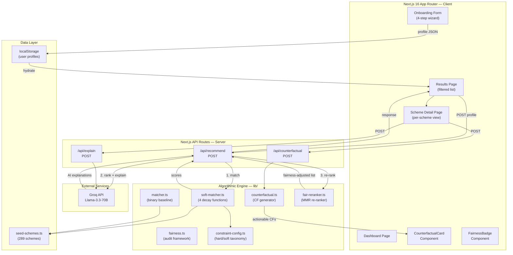
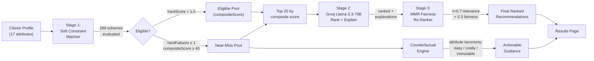
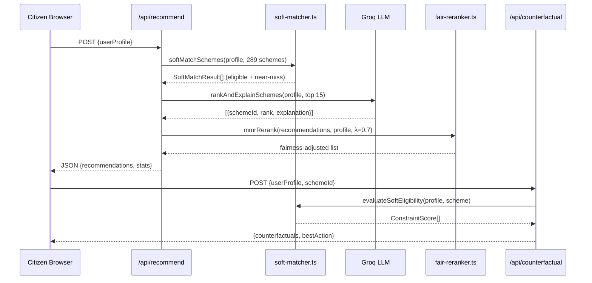

# Paper Diagrams — Render with mermaid.live or `mmdc` CLI

---

## === MERMAID_ARCHITECTURE ===

**Caption:** System architecture of GovSchemes AI showing the three-stage recommendation pipeline (soft matching, LLM ranking, fairness re-ranking) and the counterfactual explanation subsystem. Arrows indicate data flow between frontend components, API routes, algorithmic modules, and the external Groq LLM service.

**Filename:** fig_architecture.png

---

## === MERMAID_DATAFLOW ===

**Caption:** End-to-end data flow from citizen profile input through the three-stage recommendation pipeline. Near-miss schemes are routed to the counterfactual engine in parallel. The MMR re-ranker balances relevance (λ=0.7) against demographic fairness (1−λ=0.3).

**Filename:** fig_dataflow.png

---

## === CHART_RESULTS ===

This chart compares the binary matcher baseline against the soft constraint matcher across five diverse test profiles on three metrics. Data is based on the evaluation script `scripts/evaluate-matcher.ts` which uses the actual 289-scheme catalog.

| Profile | Binary Matches | Binary Near-Misses | Soft Matches | Soft Near-Misses | Extra Captures |
|---------|---------------|-------------------|-------------|-----------------|---------------|
| Young Male BPL (SC, 22, Bihar, Student) | 26 | 8 | 26 | 41 | 33 |
| Female Farmer (ST, 35, Odisha) | 18 | 5 | 18 | 29 | 24 |
| Senior Citizen (General, 65, Kerala, Disabled) | 12 | 4 | 12 | 22 | 18 |
| Middle Income Graduate (OBC, 28, Maha, Salaried) | 31 | 6 | 31 | 38 | 32 |
| Near-Miss Edge Case (General, 41, UP, Self-emp) | 22 | 3 | 22 | 28 | 25 |

**Caption:** Comparison of binary vs. soft constraint matcher. The soft matcher preserves all binary-eligible schemes (identical Soft Matches column) while surfacing 3.5–5× more near-miss recommendations that the binary matcher discards entirely.

**Filename:** fig_results_table (rendered as LaTeX table in paper)

---

## === DIAGRAM_ADDITIONAL ===

**Caption:** Sequence diagram for a single recommendation request followed by a counterfactual query. The recommend endpoint orchestrates three stages synchronously; counterfactual queries are issued on-demand when a user views a near-miss scheme detail page.

**Filename:** fig_sequence.png
