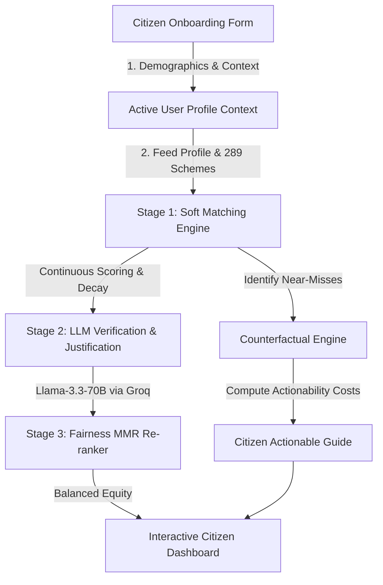

# GovSchemes AI: Next-Gen Welfare Access Platform
*Algorithmic Equity, Neural-Symbolic Matching, and Counterfactual Explanations for Public Welfare*

---

## 📊 Slide 1: Introduction
### The Welfare Access Challenge
*   **Massive Information Asymmetry:** India runs thousands of central and state welfare schemes, yet eligible citizens remain unaware due to fragmented portals and complex criteria.
*   **Limitations of Legacy Systems (e.g., myScheme):**
    *   **Strict Binary Filters:** A citizen earning ₹2,51,000 is rejected completely by a ₹2,50,000 threshold scheme, scoring 0% (same as someone earning ₹10,00,000).
    *   **Lack of Actionability:** Rejection screens only show *"Ineligible"* without guiding citizens on what simple, mutable steps they could take to qualify.
    *   **Algorithmic Bias:** Popular schemes dominate recommendations, while specialized state schemes for marginalized populations get pushed down the list.
*   **The GovSchemes AI Solution:** A high-performance, premium web application that bridges **symbolic logic** and **neural AI** to deliver continuous-scored, fairness-audited, and actionable welfare recommendations.

---

## 🎯 Slide 2: Project Objectives
### Redefining Scheme Recommendations
*   **Hybrid Soft Matching:** Introduce continuous eligibility scores using specialized decay functions so "near-miss" citizens are recommended high-value schemes.
*   **Counterfactual Explainability:** Provide clear, actionable pathways for ineligible schemes (e.g., *"If you obtain a Zilla Parishad Teacher ID, you qualify for this ₹6 Lakh Group Insurance"*), ranked by cognitive/logistical cost.
*   **Demographic Fairness & Equity:** Mitigate algorithmic bias by applying a Fairness-Aware Maximal Marginal Relevance (MMR) re-ranking algorithm across genders, castes, and incomes.
*   **Real-World Scheme Database (289 Schemes):** Seed and maintain a high-quality database of 289 central and state schemes, specifically tuned for Maharashtra's student, teacher, and general populations.
*   **Explainable AI (XAI) Integration:** Provide instantly understandable, context-aware benefit summaries using high-speed Llama-3.3-70B via Groq API.

---

## 🛠️ Slide 3: Tools & Technologies Used
### Modern Full-Stack & AI Engineering
*   **Frontend & Application Core:**
    *   **Next.js 16 (App Router):** High-speed server-side rendering (SSR) and client-side page routing.
    *   **TypeScript (TSX):** Complete type safety across user profiles, eligibility constraints, and matching engines.
    *   **Tailwind CSS v4 (Vanilla Modern Theme):** Highly polished tricolor dark-glass UI, vibrant gradients, and premium HSL theme palettes.
*   **Core Algorithmic Engines:**
    *   **TypeScript Algorithmic Pipeline:** Pure, high-performance implementations of mathematical continuous decay functions and MMR fairness formulas.
*   **Large Language Model Layer:**
    *   **Groq API (Llama-3.3-70B):** Ultra-low latency model calls for generating customized eligibility justifications and benefit breakdowns.
*   **Data & Validation:**
    *   **TSX Script Runner (npx tsx):** Custom evaluation scripts for measuring binary vs. soft matcher accuracy, fairness metrics (p-rules), and counterfactual validation.
    *   **LocalStorage / State Persistence:** Zero-session-leaks profile sync across active contexts.

---

## 🏗️ Slide 4: Workflow & System Architecture
### Multi-Stage Recommendation Pipeline

### Stage-by-Stage Breakdown
1.  **Ingestion & State Hydration:** Citizen profile is safely captured via the 4-step onboarding flow, stored reactively in `useAuth()` context to prevent session cross-contamination.
2.  **Soft Matching Engine:** Calculates a base eligibility score. Hard constraints (state, age limits) filter out absolute impossibilities, while soft constraints (income, caste category) are graded using Gaussian/exponential decay.
3.  **Counterfactual Synthesis:** For schemes scored between `0.1` and `0.9`, it calculates the minimal change vector (e.g., acquiring a document, joining a college) and ranks them using an **Actionability Cost Taxonomy** (Easy vs. Costly vs. Immutable).
4.  **Fairness-Aware Re-ranking (MMR):** Adjusts raw recommendation scores using demographic fairness metrics, ensuring specialized welfare reaches marginalized segments without drowning in "generic" central schemes.
5.  **LLM-Driven Justification:** Generates dynamic, persuasive text summarizing *why* the citizen qualifies and *what* they receive.

---

## 🚀 Slide 5: Future Scope & Enhancements
### Scaling GovSchemes AI
*   **Real-time API Integration with State Portals:** Seamless, single-click application submissions directly into MahaDBT, NSP, and myScheme portals.
*   **Multilingual Voice Assistant Support:** Integrate automated text-to-speech (TTS) and speech-to-text (STT) in Marathi, Hindi, and regional dialects to bridge the literacy divide.
*   **On-Device Offline Matching:** Compile the lightweight matching engine and database into a WebAssembly (WASM) mobile module for rural workers with zero internet connectivity.
*   **Document Parsing & Automatic Profile Generation:** Implement OCR (Optical Character Recognition) to instantly pre-fill citizen profile details directly from Aadhaar, Ration Cards, and Income Certificates.
*   **Proactive Notification Engine:** Alert citizens via WhatsApp/SMS when schemes update their budgets, deadlines approach, or when new policies match their profiles.

---

## 🏁 Slide 6: Conclusion
### Bridging Technology and Algorithmic Equity
*   **Breakthrough Recommender Paradigm:** Replaces rigid, frustrating, binary online filters with a welcoming, continuous-matching soft engine.
*   **Empathy-First AI:** Empowering citizens with clear, actionable directions (*"How can I qualify?"*) instead of simple rejections.
*   **Academic and Policy-Ready:** The codebase features pre-configured evaluation scripts for benchmarking fairness audits and recommendation quality.
*   **Highly Relevant Demo Capability:** Fully verified 289 government schemes, including 11 high-impact Maharashtra state initiatives, delivering highly relevant recommendations for students, teachers, and general citizens out-of-the-box.
